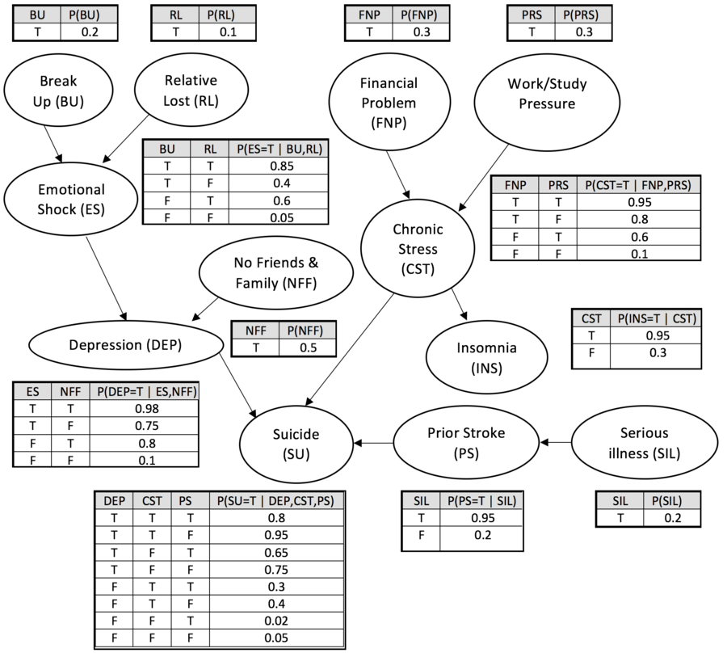
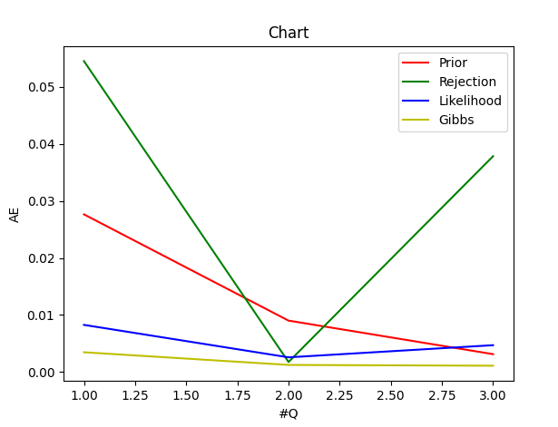
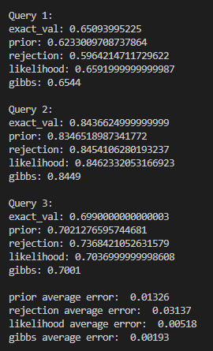

<h1>Sampling</h1>

This project aims to implement different methods of sampling, camparing <i>Exact Inference</i> and <i>Approximate Inference</i>. 

Exact Inference and Approximate Inference are two methods used in probabilistic graphical models to compute the posterior distribution of a set of variables given some evidence.

- <b>Exact Inference</b>: Exact inference computes the exact posterior distribution. This is typically done using algorithms like Variable Elimination, Belief Propagation, or Junction Tree Algorithm. These methods are very efficient for certain types of graphical models, such as trees or singly connected graphs. However, for models with high treewidth (i.e., models that are highly interconnected), exact inference can be computationally infeasible, as the time complexity is exponential in the treewidth of the graph.

- <b>Approximate Inference</b>: Approximate inference methods are used when exact inference is computationally infeasible. These methods provide an approximation to the true posterior distribution. There are two main types of approximate inference methods:

  - <b>Sampling Methods (Stochastic)</b>: These methods generate samples from the posterior distribution. Examples include Markov chain Monte Carlo (MCMC) methods like Gibbs Sampling, Metropolis-Hastings, etc.

  - <b>Deterministic Methods</b>: These methods approximate the posterior distribution directly. Examples include Variational Inference, Loopy Belief Propagation, etc.

## :star2: About the Project

### :camera: Shots

  

  Here we are given the following <i>Bayesian Network</i> and we would like to calculate some probabilities, that are refered to as <i>Queries</i>.
  

  

 

 

  

  The result and the error of each sampling (<i>Prior Sampling</i>, <i>Rejection Sampling</i>, <i>Likelihood Sampling</i> and <i>Gibbs Sampling</i>) are as follows:
  

  
  

## :toolbox: Getting Started

### :bangbang: Prerequisites

- Install python <a href="https://www.python.org/downloads/"> Here </a>

### :scroll: Code of Conduct

In this project, there are four different samplings used to find the probabilities of queries.

Here's a breakdown of the code:

the common structure of sampling implementation:

1. query: The variable(s) for which we want to compute the posterior distribution.

2. evidence: The observed variables and their values.

3. cpts: The conditional probability tables (CPTs) for the variables in the graph.

4. graph: The graph structure, which includes information about the parent nodes of each variable.

<b>exact_inference</b>: 

1. It initializes an empty list new_cpts to store the updated CPTs after incorporating the evidence.

2. It retrieves the parent nodes for each variable from the graph.

3. It iterates over each CPT. For each CPT, it creates an empty list tb.

4. For each row in the CPT, it checks if the variable corresponding to the CPT is in the evidence. If it is, and the value in the row doesn't match the evidence, it skips this row.

5. It then checks if all the parent variables of the current variable match the evidence. If they do, it adds the row to tb.

6. After iterating over all rows in the CPT, it adds tb to new_cpts.

7. Finally, it calls the variable_elimination function with the evidence, the query, and the updated CPTs, and returns the result.

<b>prior_sample</b>:

1. It sorts the vertices of the graph in topological order.

2. It initializes an empty list samples to store the generated samples.

3. It generates globals.num_samples(10000) samples. For each sample, it initializes a dictionary where each vertex is mapped to -1. Then, it samples a value for each vertex using the sample_vertex function and the current sample, and stores it in the sample dictionary. It adds the sample to the samples list.

4. It initializes two counters, consistent_with_evidence and query_evidence_true.

5. It iterates over each sample. For each sample, it checks if the sample is consistent with the evidence. If it is, it increments consistent_with_evidence. It then checks if the sample is consistent with the query. If it is, it increments query_evidence_true.

6. If consistent_with_evidence is 0, it returns 0 to avoid division by zero.

7. Finally, it returns the ratio of query_evidence_true to consistent_with_evidence. This is an estimate of the probability of the query given the evidence.

<b>rejection_sample</b>:

1. It sorts the vertices of the graph in topological order.

2. It initializes an empty list samples to store the generated samples and a counter consistent_with_evidence.

3. It generates globals.num_samples(10000) samples. For each sample, it initializes a dictionary where each vertex is mapped to -1. Then, it samples a value for each vertex using the sample_vertex function and the current sample. If the vertex is in the evidence and its sampled value doesn't match the evidence, it rejects the sample and continues to the next one.

4. If the sample is not rejected, it increments consistent_with_evidence and adds the sample to the samples list.

5. It initializes a counter query_evidence_true.

6. It iterates over each sample. For each sample, it checks if the sample is consistent with the query. If it is, it increments query_evidence_true.

7. If consistent_with_evidence is 0, it returns 0 to avoid division by zero.

8. Finally, it returns the ratio of query_evidence_true to consistent_with_evidence. This is an estimate of the probability of the query given the evidence.

<b>likelihood_sample</b>:

1. It sorts the vertices of the graph in topological order.

2. It initializes three empty lists samples, weights_all, and weights_query to store the generated samples and their weights.

3. It generates globals.num_samples(10000) samples. For each sample, it initializes a dictionary where each vertex is mapped to -1. Then, it iterates over each vertex. If the vertex is in the evidence, it sets its value to the observed value and multiplies the weight of the sample by the probability of the observed value given the parents' values in the sample. If the vertex is not in the evidence, it samples a value for the vertex.

4. It checks if the sample is consistent with the query. If it is, it adds the weight of the sample to weights_query.

5. It adds the weight of the sample to weights_all and the sample to samples.

6. If the sum of weights_all is 0, it returns 0 to avoid division by zero.

7. Finally, it returns the ratio of the sum of weights_query to the sum of weights_all. This is an estimate of the probability of the query given the evidence.

<b>gibbs_sample</b>:

1. It sorts the vertices of the graph in topological order.

2. It initializes an empty list samples to store the generated samples.

3. It generates globals.num_samples(10000) samples. For each sample, it initializes a dictionary where each vertex is mapped to -1. Then, it sets the value of each vertex in the evidence to the observed value and samples a value for each vertex not in the evidence.

4. It performs a Gibbs sampling step for each sample. For each vertex not in the evidence, it computes the conditional probability of the vertex given the rest of the variables in the sample, and samples a new value for the vertex from this conditional distribution.

5. It adds the sample to the samples list.

6. It initializes a counter query_satisfied.

7. It iterates over each sample. For each sample, it checks if the sample is consistent with the query. If it is, it increments query_satisfied.

8. Finally, it returns the ratio of query_satisfied to globals.num_samples. This is an estimate of the probability of the query given the evidence.

## :warning: License

Distributed under the MIT License.

This code is provided by <a href="https://github.com/ErfanXH">ErfanXH</a> and all rights are reserved.

Project Link: [https://github.com/ErfanXH/Sampling](https://github.com/ErfanXH/Sampling)
